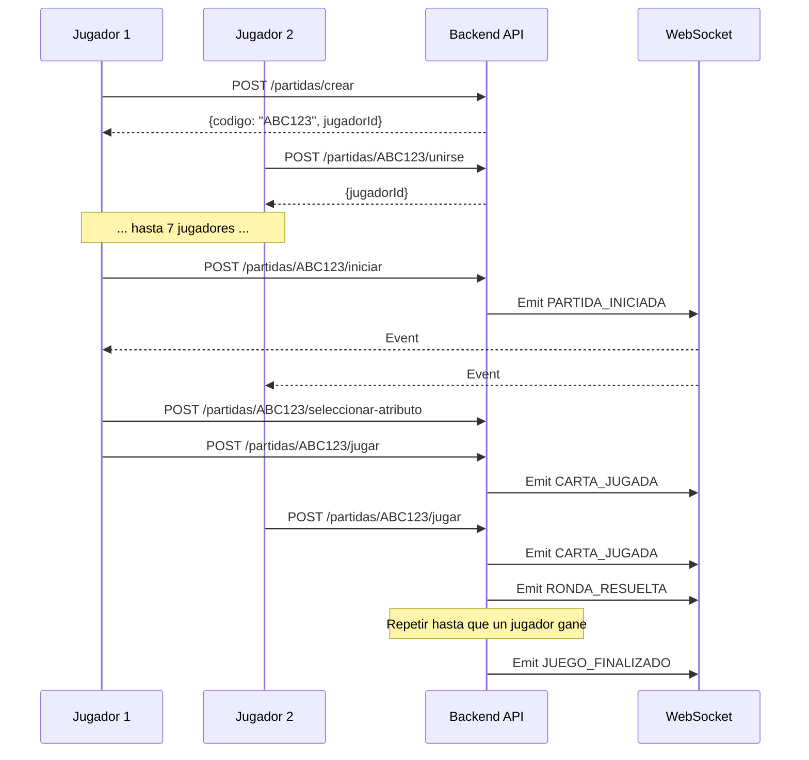

# Documentación API - Card Match Battle

## 🚀 Acceso a la Documentación

Una vez que el backend esté ejecutándose, puedes acceder a:

### Swagger UI (Interfaz Interactiva)
```
http://localhost:8080/swagger-ui.html
```
Interfaz web donde puedes:
- Ver todos los endpoints disponibles
- Probar las peticiones directamente
- Ver ejemplos de request/response
- Descargar especificación OpenAPI

### OpenAPI Specification (JSON)
```
http://localhost:8080/v3/api-docs
```
Especificación en formato JSON para generadores de clientes

### OpenAPI Specification (YAML)
```
http://localhost:8080/v3/api-docs.yaml
```
Especificación en formato YAML

---

## 📚 Endpoints Principales

### 1. Gestión de Partidas (`/api/partidas`)

#### Crear Partida
```http
POST /api/partidas/crear
Content-Type: application/json

{
  "nombreJugador": "Goku123"
}
```

**Respuesta:**
```json
{
  "codigo": "ABC123",
  "jugadorId": "uuid-1234-5678",
  "estado": "ESPERANDO",
  "numeroJugadores": 1
}
```

#### Unirse a Partida
```http
POST /api/partidas/{codigo}/unirse
Content-Type: application/json

{
  "nombreJugador": "Vegeta456"
}
```

#### Obtener Estado de Partida
```http
GET /api/partidas/{codigo}
```

#### Obtener Detalle Completo (con cartas del jugador)
```http
GET /api/partidas/{codigo}/detalle?jugadorId={jugadorId}
```

---

### 2. Lógica de Juego (`/api/partidas/{codigo}`)

#### Iniciar Partida (requiere 7 jugadores)
```http
POST /api/partidas/{codigo}/iniciar
```

#### Seleccionar Atributo
```http
POST /api/partidas/{codigo}/seleccionar-atributo
Content-Type: application/json

{
  "jugadorId": "uuid-1234-5678",
  "atributo": "poder"
}
```

Atributos válidos: `poder`, `velocidad`, `ki`, `tecnica`, `fuerza`

#### Jugar Carta
```http
POST /api/partidas/{codigo}/jugar
Content-Type: application/json

{
  "jugadorId": "uuid-1234-5678"
}
```

---

### 3. Consulta de Cartas (`/api/cartas`)

#### Listar Todas las Cartas
```http
GET /api/cartas
GET /api/cartas?tematica=Saiyan
```

#### Obtener Carta por Código
```http
GET /api/cartas/1A
```

#### Sincronizar Cartas desde API Externa
```http
POST /api/cartas/sincronizar
```

---

## 🔌 WebSocket para Actualizaciones en Tiempo Real

### Endpoint WebSocket
```
ws://localhost:8080/ws
```

### Topic de Suscripción
```
/topic/partida/{codigo}
```

### Eventos Emitidos

#### CARTA_JUGADA
```json
{
  "tipo": "CARTA_JUGADA",
  "jugadorId": "uuid-1234-5678",
  "carta": "1A",
  "valor": 950
}
```

#### RONDA_RESUELTA
```json
{
  "tipo": "RONDA_RESUELTA",
  "ganadorId": "uuid-1234-5678",
  "cartasGanadas": ["1A", "2B"],
  "empate": false
}
```

#### JUEGO_FINALIZADO
```json
{
  "tipo": "JUEGO_FINALIZADO",
  "razon": "CARTAS_AGOTADAS",
  "ganadorId": "uuid-1234-5678",
  "empate": false
}
```

Razones: `CARTAS_AGOTADAS`, `TIEMPO_LIMITE`, `JUGADOR_ABANDONO`

---

## 🎯 Integración con Next.js

### 1. Configurar Variables de Entorno

Crea un archivo `.env.local` en tu proyecto Next.js:

```env
NEXT_PUBLIC_API_URL=http://localhost:8080/api
NEXT_PUBLIC_WS_URL=ws://localhost:8080/ws
```

### 2. Cliente HTTP con Fetch API

```typescript
// lib/api.ts
const API_URL = process.env.NEXT_PUBLIC_API_URL;

export async function crearPartida(nombreJugador: string) {
  const response = await fetch(`${API_URL}/partidas/crear`, {
    method: 'POST',
    headers: { 'Content-Type': 'application/json' },
    body: JSON.stringify({ nombreJugador }),
  });
  
  if (!response.ok) {
    const error = await response.json();
    throw new Error(error.message);
  }
  
  return response.json();
}

export async function unirsePartida(codigo: string, nombreJugador: string) {
  const response = await fetch(`${API_URL}/partidas/${codigo}/unirse`, {
    method: 'POST',
    headers: { 'Content-Type': 'application/json' },
    body: JSON.stringify({ nombreJugador }),
  });
  
  if (!response.ok) throw new Error('Error al unirse a la partida');
  return response.json();
}

export async function obtenerPartidaDetalle(codigo: string, jugadorId: string) {
  const response = await fetch(
    `${API_URL}/partidas/${codigo}/detalle?jugadorId=${jugadorId}`
  );
  return response.json();
}

export async function jugarCarta(codigo: string, jugadorId: string) {
  const response = await fetch(`${API_URL}/partidas/${codigo}/jugar`, {
    method: 'POST',
    headers: { 'Content-Type': 'application/json' },
    body: JSON.stringify({ jugadorId }),
  });
  
  if (!response.ok) throw new Error('Error al jugar carta');
  return response.status;
}
```

### 3. Cliente WebSocket con STOMP

Instala la librería:
```bash
npm install @stomp/stompjs
```

Código de conexión:
```typescript
// lib/websocket.ts
import { Client } from '@stomp/stompjs';

export function conectarWebSocket(codigoPartida: string, onMessage: (event: any) => void) {
  const client = new Client({
    brokerURL: process.env.NEXT_PUBLIC_WS_URL,
    reconnectDelay: 5000,
    heartbeatIncoming: 4000,
    heartbeatOutgoing: 4000,
  });

  client.onConnect = () => {
    console.log('Conectado a WebSocket');
    
    client.subscribe(`/topic/partida/${codigoPartida}`, (message) => {
      const event = JSON.parse(message.body);
      onMessage(event);
    });
  };

  client.activate();
  return client;
}
```

### 4. Componente React de Ejemplo

```tsx
'use client';

import { useEffect, useState } from 'react';
import { conectarWebSocket } from '@/lib/websocket';
import { jugarCarta, obtenerPartidaDetalle } from '@/lib/api';

export default function GamePage({ params }: { params: { codigo: string } }) {
  const [partida, setPartida] = useState(null);
  const jugadorId = localStorage.getItem('jugadorId');

  useEffect(() => {
    // Cargar estado inicial
    obtenerPartidaDetalle(params.codigo, jugadorId).then(setPartida);

    // Conectar WebSocket para actualizaciones
    const client = conectarWebSocket(params.codigo, (event) => {
      console.log('Evento recibido:', event);
      
      if (event.tipo === 'RONDA_RESUELTA') {
        // Actualizar estado tras ronda
        obtenerPartidaDetalle(params.codigo, jugadorId).then(setPartida);
      }
    });

    return () => client.deactivate();
  }, [params.codigo, jugadorId]);

  const handleJugarCarta = async () => {
    try {
      await jugarCarta(params.codigo, jugadorId);
    } catch (error) {
      console.error('Error al jugar:', error);
    }
  };

  return (
    <div>
      <h1>Partida {params.codigo}</h1>
      {partida && (
        <>
          <p>Estado: {partida.estado}</p>
          <p>Jugadores: {partida.jugadores?.length}</p>
          <button onClick={handleJugarCarta}>Jugar Carta</button>
        </>
      )}
    </div>
  );
}
```

---

## 🛠️ Generador de Cliente TypeScript

Puedes generar un cliente TypeScript automáticamente desde la especificación OpenAPI:

### Opción 1: openapi-typescript
```bash
npm install -D openapi-typescript
npx openapi-typescript http://localhost:8080/v3/api-docs -o types/api.ts
```

### Opción 2: openapi-generator
```bash
npx @openapitools/openapi-generator-cli generate \
  -i http://localhost:8080/v3/api-docs \
  -g typescript-fetch \
  -o ./src/generated/api
```

---

## 🔒 Manejo de Errores

Todas las respuestas de error siguen este formato:

```json
{
  "status": 404,
  "error": "Not Found",
  "message": "Partida no encontrada",
  "path": "/api/partidas/XYZ999",
  "timestamp": "2025-10-09T16:30:00Z"
}
```

Códigos HTTP comunes:
- `200 OK`: Operación exitosa
- `400 Bad Request`: Datos inválidos o reglas de negocio no cumplidas
- `404 Not Found`: Recurso no encontrado
- `409 Conflict`: Estado inconsistente (ej: partida ya iniciada)
- `500 Internal Server Error`: Error interno del servidor

---

## 📊 Flujo Completo del Juego



---

## 🧪 Testing con Swagger UI

1. Inicia el backend: `mvn spring-boot:run`
2. Abre Swagger UI: http://localhost:8080/swagger-ui.html
3. Expande el grupo **Partidas**
4. Haz clic en **POST /api/partidas/crear**
5. Haz clic en "Try it out"
6. Edita el JSON de ejemplo:
```json
{
  "nombreJugador": "TestPlayer"
}
```
7. Haz clic en "Execute"
8. Copia el `codigo` y `jugadorId` de la respuesta
9. Prueba otros endpoints usando estos valores

---

## 📞 Soporte

- **Documentación interactiva**: http://localhost:8080/swagger-ui.html
- **Repositorio**: https://github.com/SLarkZ01/Juego-De-Cartas-Backend
- **Issues**: Reporta bugs en GitHub Issues

---

**¡Buena suerte con tu integración Next.js!** 🎮🐉
